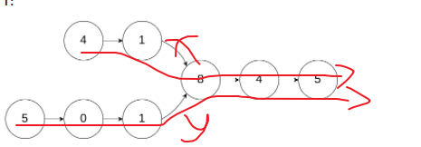

题目来自于 leetcode 的[面试题 02.07. 链表相交](https://leetcode-cn.com/problems/intersection-of-two-linked-lists-lcci/)。

#### 我的解法

算是一道数学题，如图中所示，则 **i=y-x** 的结果为较长的链表比较短的链表多的节点，我们让较长的链表先走i个节点，然后两个再一起走，边走边判断是否相同，如果碰到第一个相同的节点，则认为是第一个相交的节点。



```c
/**
 * Definition for singly-linked list.
 * struct ListNode {
 *     int val;
 *     struct ListNode *next;
 * };
 */
struct ListNode *getIntersectionNode(struct ListNode *headA, struct ListNode *headB) {
    int lenA = 0;
    int lenB = 0;

    struct ListNode *tempA = headA;
    struct ListNode *tempB = headB;
    while (tempA != NULL)
    {
        lenA++;
        tempA = tempA->next;
    }

    while (tempB != NULL)
    {
        lenB++;
        tempB = tempB->next;
    }

    int lenDiff = 0;
    if (lenA > lenB)
    {
        lenDiff = lenA - lenB;

        for (int i = 0; i < lenDiff; i++)
        {
            headA = headA->next;
        }
    }
    else
    {
        lenDiff = lenB - lenA;

        for (int i = 0; i < lenDiff; i++)
        {
            headB = headB->next;
        }
    }

    while(headA != NULL)
    {
        if(headA == headB)
            return headA;

        headA = headA->next;
        headB = headB->next;
    }

    return NULL;
}
```

